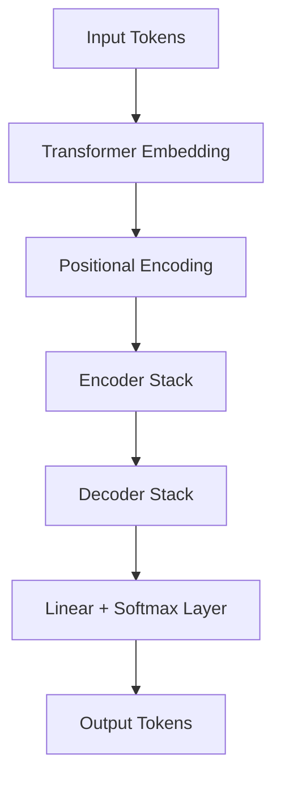
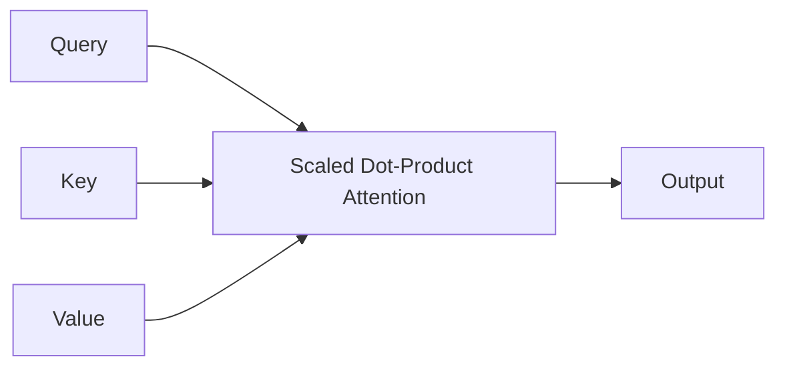
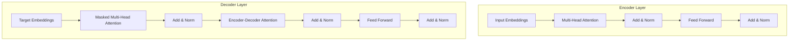

# Transformer Model from Scratch

This repository implements a Transformer architecture from scratch in Python, mirroring the design introduced in ["Attention is All You Need"](https://arxiv.org/abs/1706.03762). Each core component is modularized for clarity and educational purposes. This makes it easier to understand, extend, and visualize each part of the Transformer.

---

## 🎉 Highlights
- Complete implementation of a Transformer model.
- Core components broken into separate, easily understandable files.
- Jupyter Notebooks for visualization and step-by-step explanation.
- Ideal for learning and experimenting with attention-based models.

---

## 🔍 Architecture Overview



The architecture contains:
- **Transformer Embedding**: Converts tokens into dense vectors.
- **Positional Encoding**: Adds position information to the embeddings.
- **Encoder Stack**: Series of encoder layers.
- **Decoder Stack**: Series of decoder layers.
- **Output Layer**: Final linear layer followed by softmax.

---

## 📂 Repository Structure

```bash
.
├── Decoder_Layer.py                         # Single decoder layer
├── Decoder_stack.py                         # Stack of decoder layers
├── Encoder_Layer.py                         # Single encoder layer
├── Encoder_stack.py                         # Stack of encoder layers
├── Layer_Normalization_and_Residual_Connections.py  # Normalization & skip connections
├── Multi-Head_Attention.py                  # Multi-head attention mechanism
├── Position-Wise_FeedForward_Neural_Network.py # Feedforward network
├── PositionalEncoding.ipynb                 # Positional encoding visualization
├── README.md                                # You are here
├── Scaled_Dot_Product_Attention.ipynb       # Core attention computation demo
├── Transformer.py                           # Full model composition
├── Transformer_Embedding.py                 # Embedding logic
```

---

## 🪤 Component Descriptions

### 1. `Transformer_Embedding.py`
Handles token embeddings and optional segment embeddings.

### 2. `PositionalEncoding.ipynb`
Visualizes and explains sinusoidal positional encodings added to the embeddings.

### 3. `Encoder_Layer.py`
Consists of:
- Multi-head self-attention
- Feedforward network
- Layer norm and residual connections

### 4. `Encoder_stack.py`
Stacks multiple encoder layers to process input tokens in depth.

### 5. `Decoder_Layer.py`
Contains masked multi-head attention, encoder-decoder attention, and feedforward blocks.

### 6. `Decoder_stack.py`
Stacks multiple decoder layers, crucial for autoregressive decoding.

### 7. `Multi-Head_Attention.py`
Splits attention across multiple heads for richer representation learning.



### 8. `Scaled_Dot_Product_Attention.ipynb`
Demonstrates and visualizes attention calculation via dot-products and softmax.

### 9. `Position-Wise_FeedForward_Neural_Network.py`
Applies two-layer MLP to each token independently and identically.

### 10. `Layer_Normalization_and_Residual_Connections.py`
Normalizes and preserves gradients with residual skip connections.

### 11. `Transformer.py`
Assembles the full model pipeline from embeddings to decoder outputs.

---

## 📊 Visualization of Encoder-Decoder Layer



---

## 🔢 Core Mathematical Formulas

### Scaled Dot-Product Attention
```math
Attention(Q, K, V) = softmax((QKᵀ) / √d_k) · V
```

### Multi-Head Attention
```math
MultiHead(Q, K, V) = Concat(head₁, ..., head_h) · Wᴼ
where headᵢ = Attention(Q · Wᵢ^Q, K · Wᵢ^K, V · Wᵢ^V)
```

### Positional Encoding (sinusoidal)
```math
PE(pos, 2i)   = sin(pos / 10000^(2i / d_model))
PE(pos, 2i+1) = cos(pos / 10000^(2i / d_model))
```

### Feed Forward Network
```math
FFN(x) = max(0, x · W₁ + b₁) · W₂ + b₂
```

### Layer Normalization
```math
LayerNorm(x) = ((x - μ) / √(σ² + ε)) · γ + β
```

### Residual Connection
```math
Output = LayerNorm(x + Sublayer(x))
```

### Output Probability
```math
P(y) = softmax(x · Wᵀ)
```

---

## 🚀 Getting Started

### Prerequisites
```bash
pip install numpy torch
```

### Usage Example
```python
from Transformer import Transformer

model = Transformer(
    num_layers=6,
    d_model=512,
    num_heads=8,
    d_ff=2048,
    input_vocab_size=8000,
    target_vocab_size=8000,
    max_seq_len=100
)

output = model(input_seq, target_seq)
```

---

## 📄 References
- Vaswani et al. (2017), *Attention is All You Need*
- The Annotated Transformer by Harvard NLP
- Illustrated Transformer by Jay Alammar

---

## 🌟 Contribution
Feel free to fork the repo and send a pull request if you'd like to:
- Optimize performance
- Add more notebooks and visualizations
- Port it to TensorFlow or JAX

---

## 🛠️ License
This repository is under the MIT License.

---

## 😊 Happy Learning!

